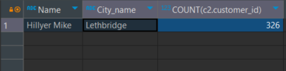
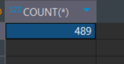
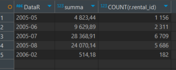

# Task 1
#### Одним запросом получите информацию о магазине, в котором обслуживается более 300 покупателей, и выведите в результат следующую информацию: фамилия и имя сотрудника из этого магазина; город нахождения магазина; количество пользователей, закреплённых в этом магазине.

```sql
SELECT 
	CONCAT(s.last_name," ",s.first_name) AS Name,
	c.city AS City_name,
	COUNT(c2.customer_id)
from staff s 
join address a ON s.address_id = a.address_id 
JOIN city c ON a.city_id = c.city_id
JOIN store s2 on s.staff_id = s2.store_id 
JOIN customer c2 on s2.store_id = c2.store_id
GROUP by s2.store_id
HAVING COUNT(c2.customer_id) > 300;
```



# Task 2
#### Получите количество фильмов, продолжительность которых больше средней продолжительности всех фильмов.

```sql
SELECT 
	COUNT(*) 
FROM film f
WHERE
	`length` > (SELECT AVG(`length`) FROM film f)
```



# Task 3
#### Получите информацию, за какой месяц была получена наибольшая сумма платежей, и добавьте информацию по количеству аренд за этот месяц.

```sql
SELECT 
	DATE_FORMAT(p.payment_date, '%Y-%m') AS 'DataR',
	SUM(p.amount) AS summa,
	COUNT(r.rental_id)
FROM payment p 
JoiN rental r ON r.rental_id = p.rental_id
GROUP BY 
	DATE_FORMAT(p.payment_date, '%Y-%m') 
ORDER BY 'DataR' DESC 
```


