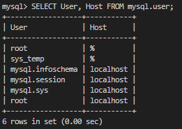
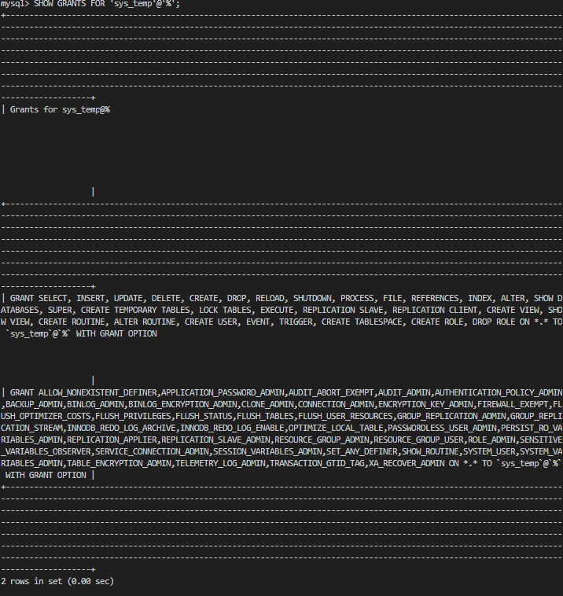
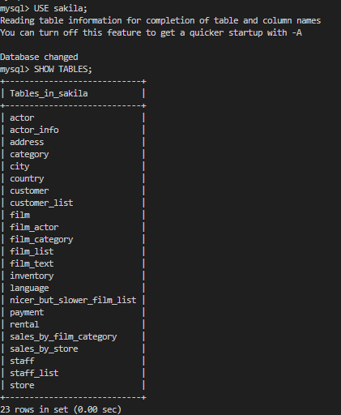
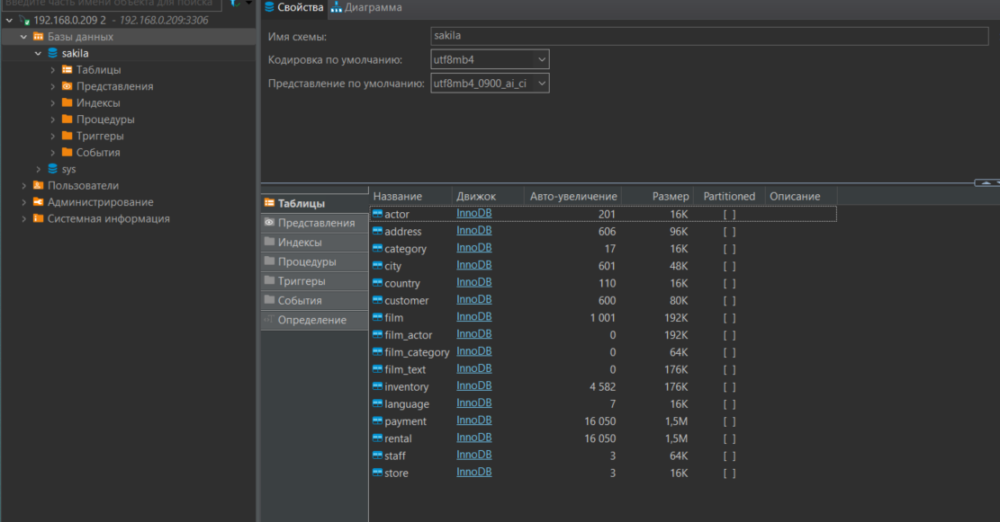

# Task 1
## Task solution

1. Установил docker and docker compose
2. Downloaded images mysql - sudo docker pull mysql:latest
3. Created docker-compose.yml
```yaml
version: '3.1'

services:
  mysql:
    image: mysql
    container_name: mysql-container
    environment:
      MYSQL_ROOT_PASSWORD: admin
      MYSQL_USER: sys_temp
      MYSQL_PASSWORD: tmp123
    ports:
      - "3306:3306"
    volumes:
      - mysql-data:/var/lib/mysql

volumes:
  mysql-data:
```
4. Created container mysql - sudo docker-compose up -d
5. Connection MySQL - sudo docker exec -it mysql-container mysql -u root -p
6. docker exec -it mysql-container mysql -u root -p
7. ```mysql
   CREATE USER 'sys_temp'@'%' IDENTIFIED BY 'tmp123';
   GRANT ALL PRIVILEGES ON *.* TO 'sys_temp'@'%' WITH GRANT OPTION; FLUSH PRIVILEGES;
   ```
8. Show rules - SHOW GRANTS FOR 'sys_temp'@'%';





9.
```
sudo docker exec -i mysql-container mysql -u sys_temp -p < sakila-db/sakila-schema.sql
sudo docker exec -i mysql-container mysql -u sys_temp -p < sakila-db/sakila-data.sql
```








